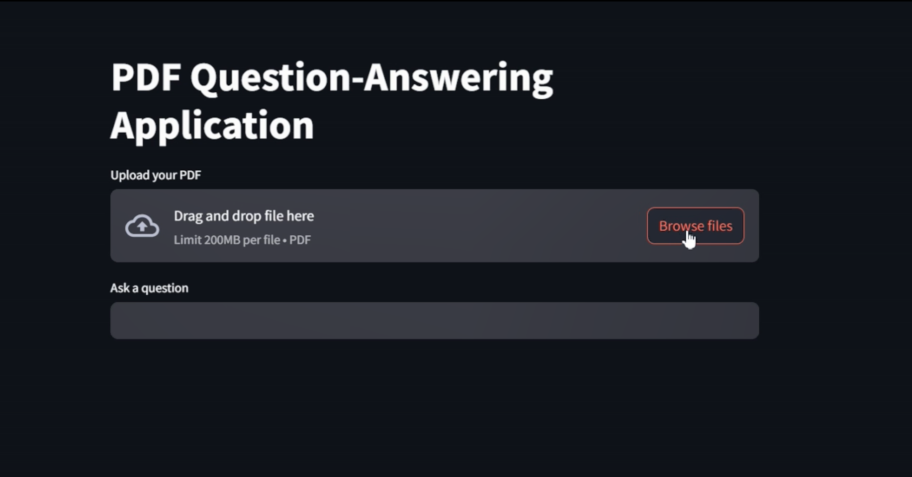

# PDF-Question-Answering-Application

I developed a 𝗣𝗗𝗙 𝗤𝘂𝗲𝘀𝘁𝗶𝗼𝗻-𝗔𝗻𝘀𝘄𝗲𝗿𝗶𝗻𝗴 𝗔𝗽𝗽𝗹𝗶𝗰𝗮𝘁𝗶𝗼𝗻 leveraging 𝗟𝗮𝗿𝗴𝗲 𝗟𝗮𝗻𝗴𝘂𝗮𝗴𝗲 𝗠𝗼𝗱𝗲𝗹𝘀 (𝗟𝗟𝗠𝘀) to transform how we interact with documents. This app enables users to upload PDFs and get precise, context-aware answers to their queries in seconds.  

🛠 𝗧𝗲𝗰𝗵𝗻𝗼𝗹𝗼𝗴𝗶𝗲𝘀 𝗨𝘀𝗲𝗱:  
🌟 LangChain: Seamless prompt chaining for context handling.  
🤖 OpenAI: Powering natural language understanding and generation.  
🗃 ChromaDB: Efficient vector storage and semantic search.  
💻 Streamlit: For a sleek, user-friendly interface.  
⚡ FastAPI: Ensuring a fast and scalable backend.  
🐍 Python: The backbone of the application.  

✨ 𝗞𝗲𝘆 𝗙𝗲𝗮𝘁𝘂𝗿𝗲𝘀:  
📄 Easy PDF uploads.  
❓ Context-aware, accurate answers to queries.  
🚀 Fast, efficient, and user-focused experience. 

